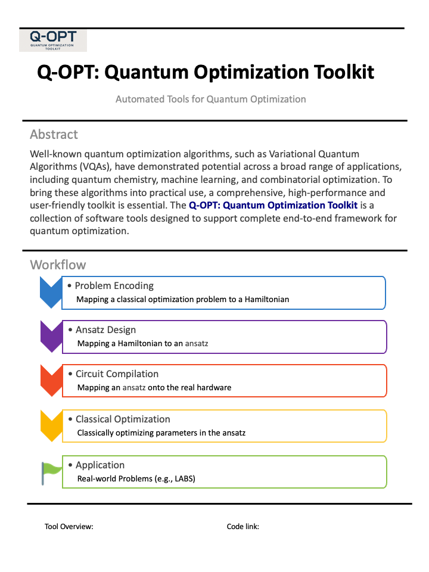

.. Quantum Optimization Toolkit documentation master file, created by
   sphinx-quickstart on Fri Jul 18 22:04:37 2025.
   You can adapt this file completely to your liking, but it should at least
   contain the root `toctree` directive.

.. Add your content using ``reStructuredText`` syntax. See the
.. `reStructuredText <https://www.sphinx-doc.org/en/master/usage/restructuredtext/index.html>`_
.. documentation for details.

Welcome to the Q-OPT: Quantum Optimization Toolkit
===================================================

Well-known quantum optimization algorithms, such as Variational Quantum Algorithms (VQAs), have demonstrated potential across a broad range of applications, including quantum chemistry, machine learning, and combinatorial optimization.
To bring these algorithms into practical use, a comprehensive, high-performance and user-friendly toolkit is essential.
The **Q-OPT: Quantum Optimization Toolkit** is a collection of software tools designed to support quantum optimization workflows. 
We provide a complete end-to-end framework for solving classical optimization problems using quantum algorithms in this toolkit.

.. Explore the components of the toolkit:

.. - :ref:`Ansatz Design <ansatz_design>`
.. - :ref:`Problem Encoding <problem_encoding>`
.. - :ref:`Circuit Synthesis <circuit_synthesis>`
.. - :ref:`Classical Optimizer <classical_optimizer>`
.. - :ref:`Application <application>`
.. - :ref:`Conclusion <conclusion>`

.. raw:: html

   <table style="width:100%">
     <tr>
       <td style="width:65%; vertical-align:top">

.. toctree::
   :maxdepth: 2
   :caption: Handbook

   handbook/introduction
   handbook/problem_encoding
   handbook/ansatz_design
   handbook/circuit_compilation
   handbook/classical_optimizer
   handbook/application
   handbook/reference

.. raw:: html

       </td>
       <td style="width:35%; vertical-align:top; text-align:center; padding-left:20px">

`Download the Flyer <_static/QuantumOptimization.pdf>`_

.. raw:: html

       </td>
     </tr>
   </table>

.. toctree::
   :maxdepth: 1
   :caption: Tool Overview

   tool/overview

All tools are accessible through our public platform: `<link>`_.

